# Lab 1 & 2 — OCI Environment Deployment Documentation
**Ejada Egypt Summer Internship 2026 — Cloud Build Track**
**Intern:** Beshoy Sorial Goda | **Compartment:** `intern-06-beshoy-goda-cmp` | **Region:** `me-jeddah-1`

---

## Table of Contents
1. [Environment Overview](#1-environment-overview)
2. [Lab 1 — Manual Console Deployment](#2-lab-1--manual-console-deployment)
   - [VCN](#21-virtual-cloud-network-vcn)
   - [Internet Gateway](#22-internet-gateway)
   - [Route Table](#23-route-table)
   - [Security List](#24-security-list)
   - [Subnet](#25-public-subnet)
   - [Compute Instance](#26-compute-instance)
   - [Block Volume](#27-block-volume)
   - [File Storage & NFS](#28-file-storage--nfs-mount)
3. [Issues & Troubleshooting](#3-issues--troubleshooting)
4. [Lab 1 Cleanup](#4-lab-1-cleanup)
5. [Lab 2 — Terraform Deployment](#5-lab-2--terraform-deployment)
   - [Terraform Code Structure](#51-terraform-code-structure)
   - [Commands Used](#52-commands-used)
   - [Apply Output](#53-terraform-apply-output)
   - [State & Graph](#54-state-list--dependency-graph)
   - [Destroy](#55-terraform-destroy)
6. [Lessons Learned](#6-lessons-learned)

---

## 1. Environment Overview

| Item | Value |
|---|---|
| Provider | Oracle Cloud Infrastructure (OCI) |
| Region | Saudi Arabia West — `me-jeddah-1` |
| Availability Domain | `oXVt:ME-JEDDAH-1-AD-1` |
| Tenancy | Shared Ejada internship tenancy (managed by program admins) |
| Compartment | `intern-06-beshoy-goda-cmp` |
| Compartment OCID | `ocid1.compartment.oc1..aaaaaaaa3gjpibo4275znepp6cslccezhjaokbsdtuza6b2z6ho2ucpwcttq` |
| Local Dev Environment | Terraform run from WSL (Ubuntu on Windows); OCI CLI configured with API key |

---

## 2. Lab 1 — Manual Console Deployment

The goal of Lab 1 was to build a complete OCI environment manually through the OCI Console. Resources were created in dependency order.

### 2.1 Virtual Cloud Network (VCN)

Created a VCN with CIDR `10.0.0.0/16`.

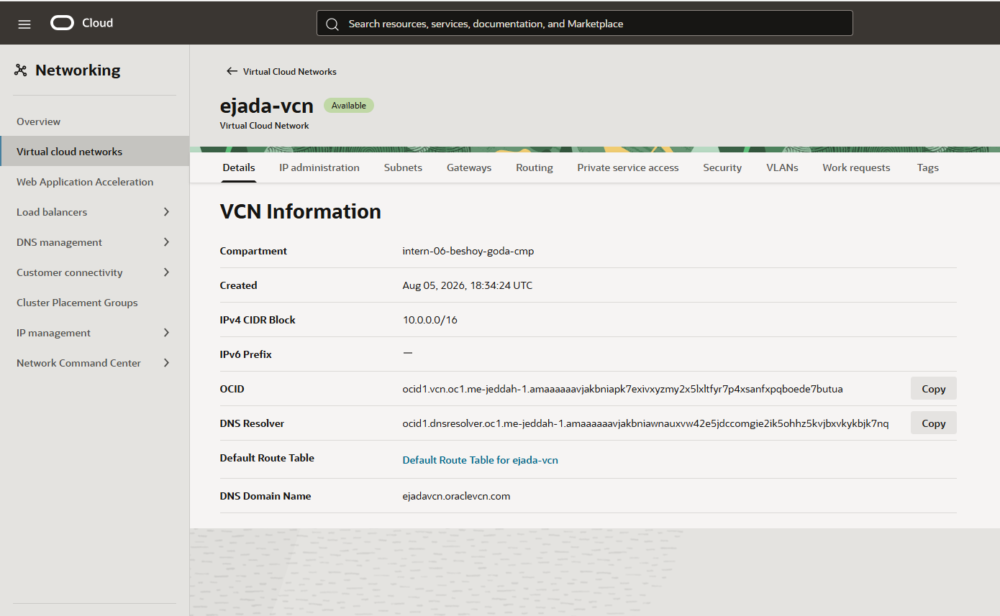

> **Note — Issue encountered here (see [Issue 1](#issue-1--vcn-creation-blocked-by-service-limit)):** The first attempt was blocked by a `vcn-count` service limit error. This was escalated to the program admin to resolve.

---

### 2.2 Internet Gateway

Created an Internet Gateway (`ejada-igw`) and attached it to the VCN.

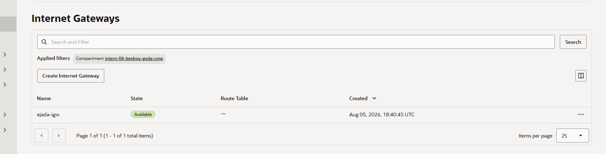

---

### 2.3 Route Table

Created a custom route table with a default route: `0.0.0.0/0 → Internet Gateway`.

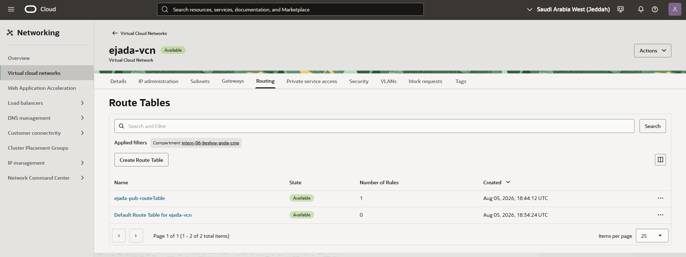

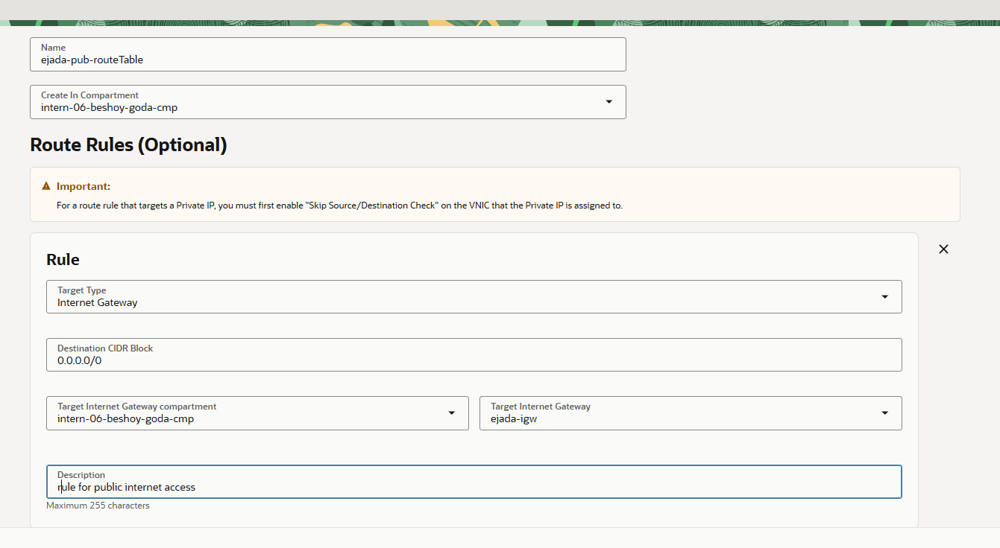

---

### 2.4 Security List

Created a security list with the following rules:
- **Ingress TCP 22** (SSH) — from `0.0.0.0/0`
- **Ingress TCP 80** (HTTP) — from `0.0.0.0/0`
- **Ingress TCP/UDP 111** (NFS portmapper) — from VCN CIDR
- **Ingress TCP 2048** (NFS statd) — from VCN CIDR
- **Ingress TCP 2049** (NFS) — from VCN CIDR
- **Ingress TCP 2050** (NFS mountd/nlockmgr) — from VCN CIDR
- **Egress all** — to `0.0.0.0/0`

> The NFS ports (111, 2048, 2050) were added after the initial NFS mount failure — see [Issue 2](#issue-2--nfs-mount-failing).

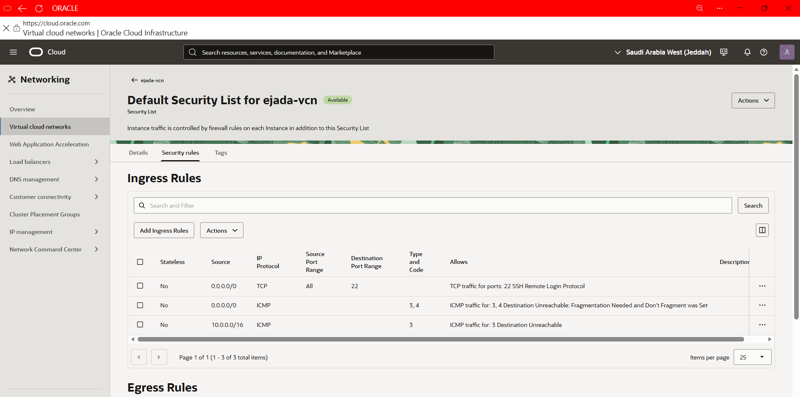

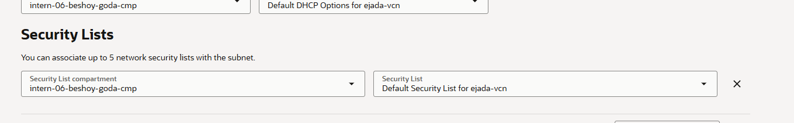

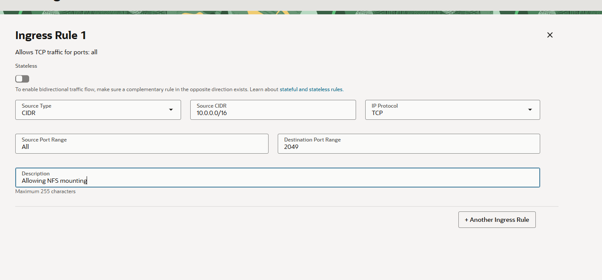

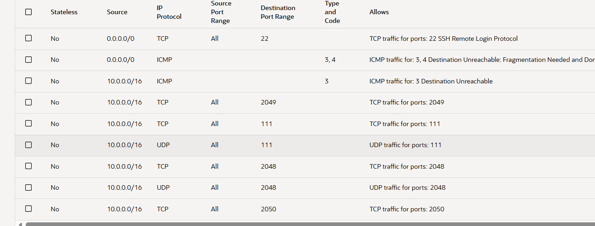

---

### 2.5 Public Subnet

Created a public subnet (`10.0.0.0/24`) with public IP assignment enabled, attached to the route table and security list created above.

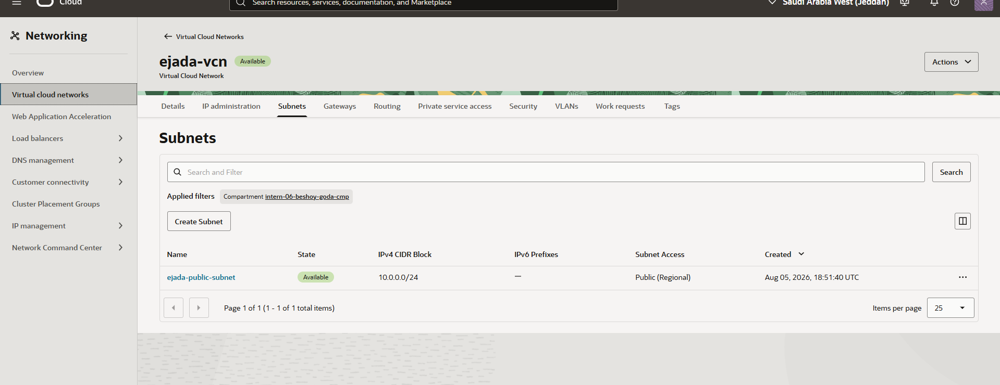

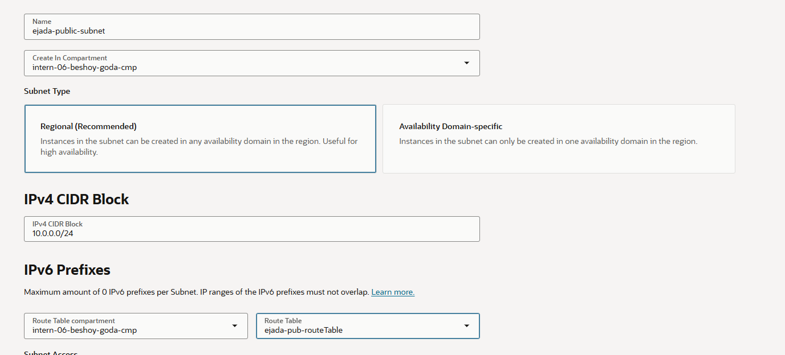

---

### 2.6 Compute Instance

Created a compute instance with:
- **Image:** Oracle Linux 10
- **Shape:** VM.Standard.E5.Flex (1 OCPU, 6 GB RAM)
- **Network:** placed in the public subnet above
- **SSH key:** generated and downloaded from the console

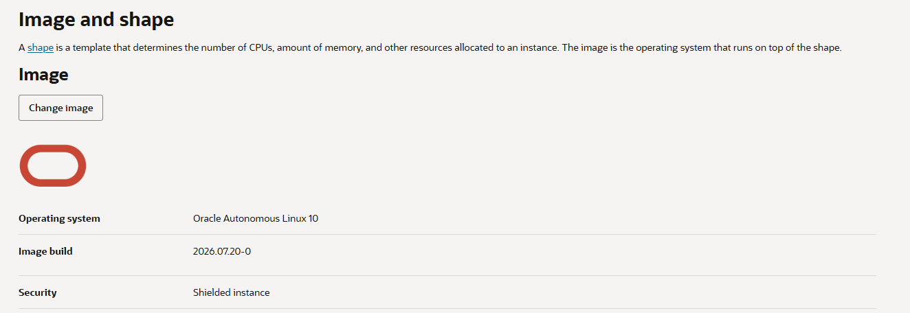

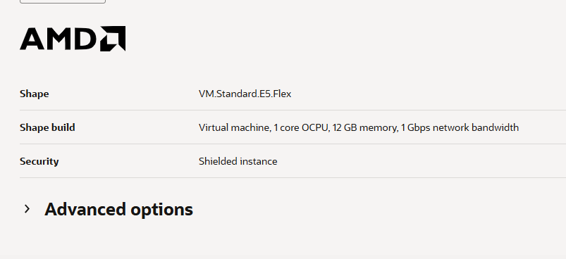

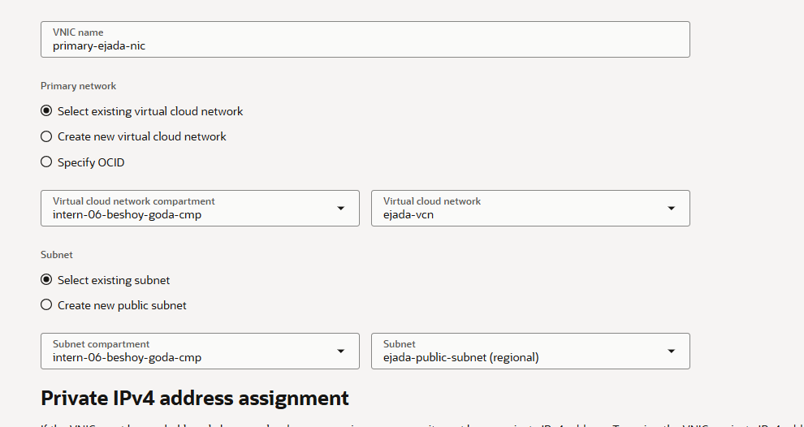

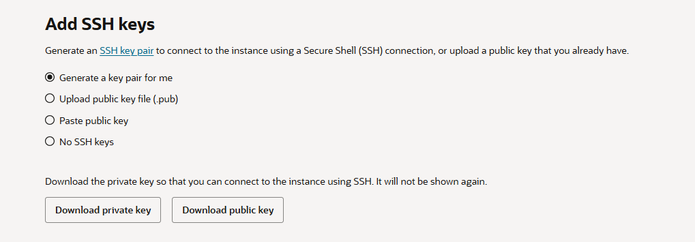

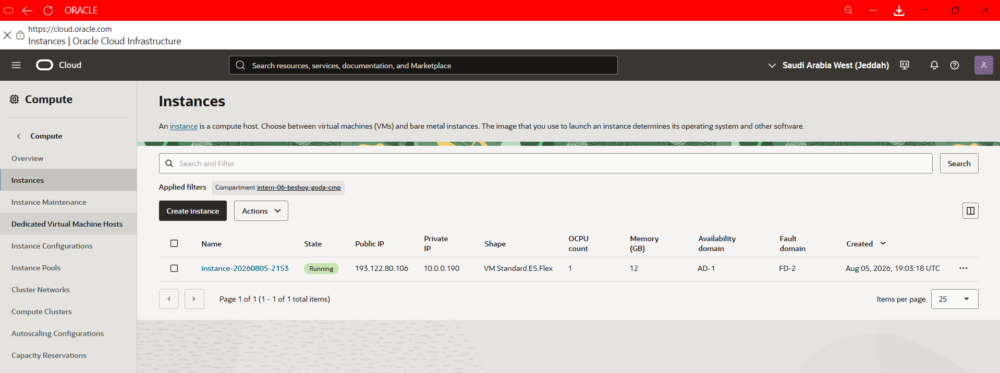

---

### 2.7 Block Volume

Created a 50 GB Block Volume, attached to the compute instance via **paravirtualized** attachment, formatted as `ext4`, and mounted at `/mnt/blockvol`.

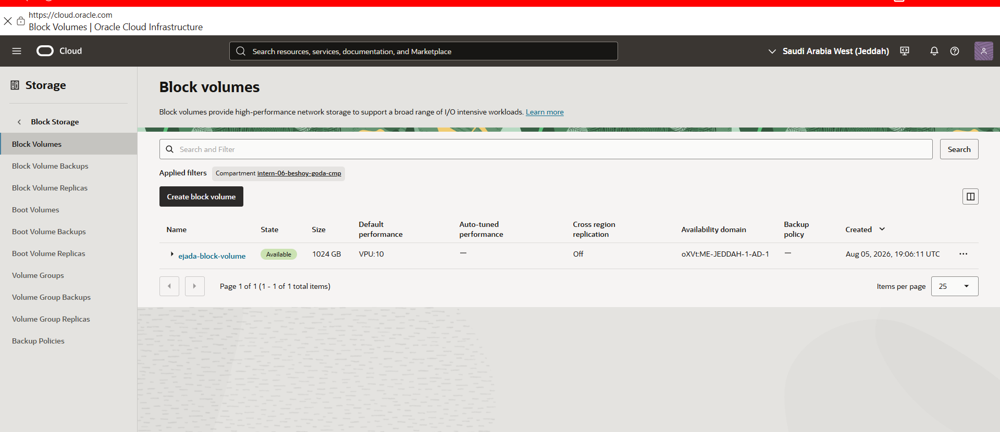

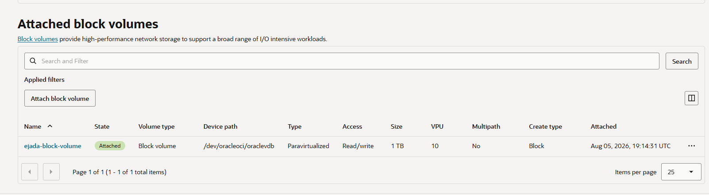

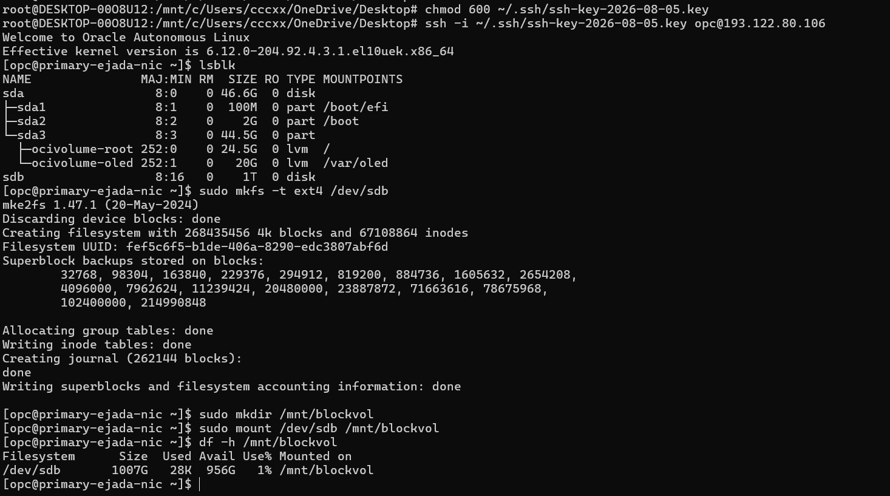

---

### 2.8 File Storage & NFS Mount

Created an OCI File Storage file system, a mount target in the same public subnet, and an NFS export. After resolving [Issue 2](#issue-2--nfs-mount-failing), the file system was successfully mounted at `/mnt/filestorage` using NFSv3.

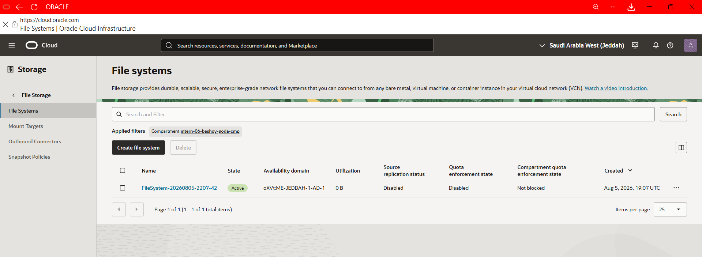

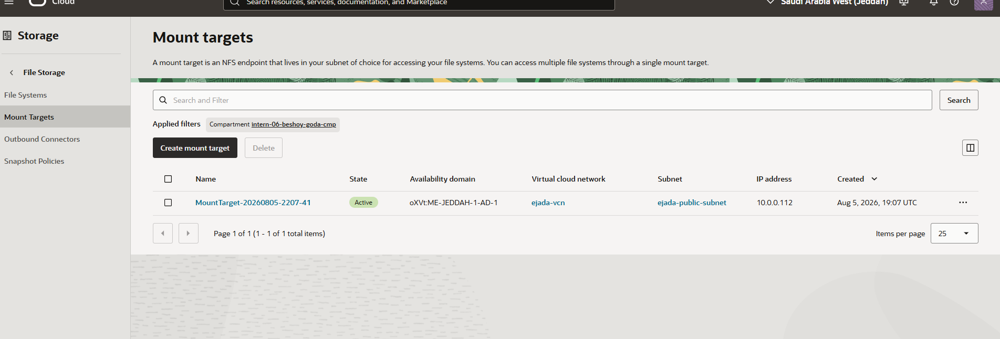

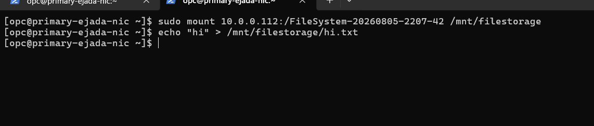

---

## 3. Issues & Troubleshooting

### Issue 1 — VCN Creation Blocked by Service Limit

**Error:** `service limits were exceeded: vcn-count`, even though no VCNs existed in the compartment.

**Investigation:** Navigated to *Governance & Administration → Limits, Quotas and Usage*. The filter fields were non-interactive and returned no data — an IAM restriction prevented the account from reading tenancy-level limit data.

**Resolution:** Escalated to the program mentor/admin. Standard self-serve options (delete unused VCNs, request limit increase, switch region) were not available in this managed shared tenancy.

---

### Issue 2 — NFS Mount Failing Despite TCP 2049 Being Reachable

**Symptoms:**
- `nc -zv <mount_target_ip> 2049` — **succeeded**
- `ping <mount_target_ip>` — **failed / hung**
- `rpcinfo -p <mount_target_ip>` — **failed**
- `mount -t nfs <mount_target_ip>:/ejadaexport /mnt/filestorage` — **hung indefinitely**
- `mount -t nfs4 ...` — returned **"Protocol not supported"**

**Root Cause:** The security list only had TCP 2049 open. NFSv3 depends on the **portmapper (port 111)** to discover auxiliary RPC services (`mountd`, `statd`, `nlockmgr`). Without port 111, all mount attempts stall waiting for the portmapper response.

NFSv4/4.1 returning "Protocol not supported" is unrelated to firewall — OCI File Storage mount targets use **NFSv3 as the supported baseline**.

**Fix:** Added ingress rules for:
| Protocol | Port | Service |
|---|---|---|
| TCP + UDP | 111 | portmapper |
| TCP + UDP | 2048 | statd |
| TCP | 2049 | nfsd (already existed) |
| TCP | 2050 | mountd / nlockmgr |

All scoped to VCN CIDR `10.0.0.0/16`.

**Successful mount command:**
```bash
mount -t nfs -o vers=3 <mount_target_ip>:/ejadaexport /mnt/filestorage
```

---

### Issue 3 — Compartment OCID Not Retrievable Through Console (Lab 2)

**Error:** The Compartments admin page returned *"Resource Not Found / Authorization failed"* — an IAM restriction on browsing compartment details.

**Resolution:** Retrieved via OCI CLI:
```bash
oci iam compartment list \
  --compartment-id <parent_compartment_ocid> \
  --compartment-id-in-subtree true \
  --query "data[?name=='intern-06-beshoy-goda-cmp'].id | [0]"
```

---

### Issue 4 — `terraform apply` Errors on First Run (Lab 2)

Two bugs surfaced on the first apply:

**Bug 1 — Flexible shape missing `shape_config`:**

Error: `Invalid ShapeConfig: null (Cannot launch flexible instance without ShapeConfig)`

The configured shape (`VM.Standard.E5.Flex`) is a flexible shape and requires explicit OCPU + memory values.

Fix — added a `dynamic "shape_config"` block that activates only when the shape name contains "Flex":
```hcl
dynamic "shape_config" {
  for_each = length(regexall("Flex", var.instance_shape)) > 0 ? [1] : []
  content {
    ocpus         = var.instance_ocpus
    memory_in_gbs = var.instance_memory_in_gbs
  }
}
```

**Bug 2 — Invalid `oci_file_storage_export_set` resource:**

Error: `GetMountTarget failed with InvalidParameter`

The original code defined `oci_file_storage_export_set` as a separate resource and passed its own ID as a mount target ID. Export sets are **auto-created alongside their mount target** and must never be managed as a separate resource.

Fix — removed the invalid `export_set` resource. The export now references the auto-created export set directly:
```hcl
resource "oci_file_storage_export" "ejada_export" {
  export_set_id  = oci_file_storage_mount_target.ejada_mount_target.export_set_id
  file_system_id = oci_file_storage_file_system.ejada_fs.id
  path           = "/ejadaexport"
}
```

---

## 4. Lab 1 Cleanup

Resources were deleted in reverse dependency order to avoid constraint violations:

1. Unmount NFS (`umount /mnt/filestorage`)
2. Unmount block volume (`umount /mnt/blockvol`)
3. Detach & delete block volume
4. Delete NFS export → mount target → file system
5. Terminate compute instance (+ boot volume)
6. Delete subnet
7. Delete route table, security list, IGW
8. Delete VCN

All service pages confirmed zero resources before starting Lab 2.

---

## 5. Lab 2 — Terraform Deployment

Lab 2 recreates the exact same environment as Lab 1 using Terraform (IaC), run from WSL on the local machine.

### 5.1 Terraform Code Structure

| File | Purpose |
|---|---|
| `providers.tf` | OCI provider configuration, API key auth |
| `variables.tf` | Input variables (tenancy/user OCIDs, region, SSH key, shape, etc.) |
| `network.tf` | VCN, IGW, route table, security list (all NFS ports), public subnet |
| `compute.tf` | Compute instance (with Flex shape support), block volume, volume attachment |
| `storage.tf` | File system, mount target, NFS export |
| `outputs.tf` | Instance public IP, VCN/subnet/volume IDs, mount target export path |
| `terraform.tfvars.secret` | Actual variable values (git-ignored) |

**`providers.tf`**
```hcl
terraform {
  required_providers {
    oci = {
      source  = "oracle/oci"
      version = ">= 5.0.0"
    }
  }
}

provider "oci" {
  tenancy_ocid     = var.tenancy_ocid
  user_ocid        = var.user_ocid
  fingerprint      = var.fingerprint
  private_key_path = var.private_key_path
  region           = var.region
}
```

**`storage.tf`**
```hcl
resource "oci_file_storage_file_system" "ejada_fs" {
  compartment_id      = var.compartment_ocid
  availability_domain = var.availability_domain
  display_name        = "ejada-file-system"
}

resource "oci_file_storage_mount_target" "ejada_mount_target" {
  compartment_id      = var.compartment_ocid
  availability_domain = var.availability_domain
  subnet_id           = oci_core_subnet.ejada_public_subnet.id
  display_name        = "ejada-mount-target"
}

resource "oci_file_storage_export" "ejada_export" {
  export_set_id  = oci_file_storage_mount_target.ejada_mount_target.export_set_id
  file_system_id = oci_file_storage_file_system.ejada_fs.id
  path           = "/ejadaexport"
}
```

---

### 5.2 Commands Used

```bash
# 1. Initialize Terraform (download OCI provider)
terraform init

# 2. Create the plan (secrets kept out of shell history via var-file)
terraform plan -var-file="terraform.tfvars.secret" -out=tf.plan

# 3. Apply the saved plan
terraform apply -var-file="terraform.tfvars.secret" tf.plan

# 4. List all resources tracked in state
terraform state list

# 5. Generate dependency graph (DOT format)
terraform graph > graph.dot

# 6. Render graph to PNG (requires graphviz — installed via apt)
apt install graphviz
dot -Tpng graph.dot -o ../Evidence/graph.png

# 7. Destroy all resources
terraform destroy -var-file="terraform.tfvars.secret" --auto-approve
```

---

### 5.3 Terraform Apply Output

```
oci_core_volume.ejada_block_volume: Creating...
oci_file_storage_file_system.ejada_fs: Creating...
oci_core_vcn.ejada_vcn: Creating...
oci_core_vcn.ejada_vcn: Creation complete after 1s [id=ocid1.vcn.oc1.me-jeddah-1.amaaaaaavjakbniagku4mk4ntsjycr5gcrnvx2lfmorxnfgytne64jyhjdma]
oci_core_internet_gateway.ejada_igw: Creating...
oci_core_security_list.ejada_public_sl: Creating...
oci_core_security_list.ejada_public_sl: Creation complete after 1s
oci_core_internet_gateway.ejada_igw: Creation complete after 1s
oci_core_route_table.ejada_public_rt: Creating...
oci_file_storage_file_system.ejada_fs: Creation complete after 2s
oci_core_route_table.ejada_public_rt: Creation complete after 0s
oci_core_subnet.ejada_public_subnet: Creating...
oci_core_subnet.ejada_public_subnet: Creation complete after 3s
oci_file_storage_mount_target.ejada_mount_target: Creating...
oci_core_instance.ejada_instance: Creating...
oci_core_volume.ejada_block_volume: Creation complete after 14s
oci_file_storage_mount_target.ejada_mount_target: Creation complete after 17s
oci_file_storage_export.ejada_export: Creating...
oci_file_storage_export.ejada_export: Creation complete after 5s
oci_core_instance.ejada_instance: Creation complete after 39s
oci_core_volume_attachment.ejada_volume_attachment: Creating...
oci_core_volume_attachment.ejada_volume_attachment: Creation complete after 27s

Apply complete! Resources: 11 added, 0 changed, 0 destroyed.

Outputs:

block_volume_id          = "ocid1.volume.oc1.me-jeddah-1.abvgkljrsbgnmv6mi7vqjj57shtcjyhhpvmzgtlw5ipeqigga4xg25li7ozq"
instance_public_ip       = "193.122.87.218"
mount_target_export_path = "ocid1.mounttarget.oc1.me_jeddah_1.aaaaaa4np2yctrm2njswillqojxwiotnmuwwuzlemrqwqljrfvqwiljr:/ejadaexport"
public_subnet_id         = "ocid1.subnet.oc1.me-jeddah-1.aaaaaaaa54rfwjtnd5uvuffjcetardcgbs33qfgmbeexvq3uyobyorvgfgyq"
vcn_id                   = "ocid1.vcn.oc1.me-jeddah-1.amaaaaaavjakbniagku4mk4ntsjycr5gcrnvx2lfmorxnfgytne64jyhjdma"
```

---

### 5.4 State List & Dependency Graph

**`terraform state list` output — all 12 resources tracked:**

```
data.oci_core_images.ol_images
oci_core_instance.ejada_instance
oci_core_internet_gateway.ejada_igw
oci_core_route_table.ejada_public_rt
oci_core_security_list.ejada_public_sl
oci_core_subnet.ejada_public_subnet
oci_core_vcn.ejada_vcn
oci_core_volume.ejada_block_volume
oci_core_volume_attachment.ejada_volume_attachment
oci_file_storage_export.ejada_export
oci_file_storage_file_system.ejada_fs
oci_file_storage_mount_target.ejada_mount_target
```

**Resource dependency graph** (`terraform graph | dot -Tpng`):

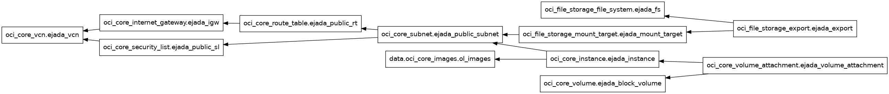

The graph confirms the correct dependency chain:
- `VCN` → `IGW` → `Route Table` → `Subnet` → `Instance` & `Mount Target`
- `Volume` + `Instance` → `Volume Attachment`
- `File System` + `Mount Target` → `Export`

---

### 5.5 Terraform Destroy

After verification, all resources were torn down using `terraform destroy --auto-approve`. Terraform destroyed all 11 resources in correct reverse-dependency order:

```
oci_file_storage_export.ejada_export: Destruction complete after 3s
oci_file_storage_file_system.ejada_fs: Destruction complete after 1s
oci_file_storage_mount_target.ejada_mount_target: Destruction complete after 28s
oci_core_volume_attachment.ejada_volume_attachment: Destruction complete after 24s
oci_core_volume.ejada_block_volume: Destruction complete after 7s
oci_core_instance.ejada_instance: Destruction complete after 1m11s
oci_core_subnet.ejada_public_subnet: Destruction complete after 1s
oci_core_route_table.ejada_public_rt: Destruction complete after 1s
oci_core_security_list.ejada_public_sl: Destruction complete after 1s
oci_core_internet_gateway.ejada_igw: Destruction complete after 0s
oci_core_vcn.ejada_vcn: Destruction complete after 1s

Destroy complete! Resources: 11 destroyed.
```

---

## 6. Lessons Learned

| # | Lesson |
|---|---|
| 1 | **NFS needs more than port 2049.** OCI security lists don't auto-include the full NFS port set. Only opening 2049 leaves portmapper-dependent operations (mount, rpcinfo) broken. Ports 111, 2048, and 2050 are also required. |
| 2 | **NFSv4 is not guaranteed on OCI.** OCI File Storage mount targets use NFSv3 as the supported baseline. Always mount with `-o vers=3`. |
| 3 | **Block volume mounts aren't persistent.** Without an `/etc/fstab` entry, the mount is lost on reboot. |
| 4 | **Flexible shapes need explicit `shape_config`.** Fixed shapes ignore it; Flex shapes require OCPU + memory values or Terraform will error. |
| 5 | **Never define `export_set` as a separate Terraform resource.** OCI creates it automatically with the mount target. Reference `mount_target.export_set_id` directly. |
| 6 | **IAM restrictions in a shared training tenancy can block normal console workflows.** Viewing quotas/limits and browsing compartment details failed in the console but worked via OCI CLI — always have the CLI as a fallback. |
| 7 | **`terraform plan -out=tf.plan` is best practice.** Saving the plan guarantees `apply` executes exactly what was reviewed, with no drift between plan and apply. |
